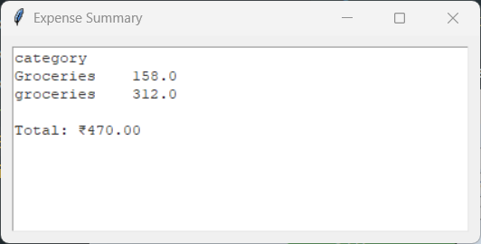
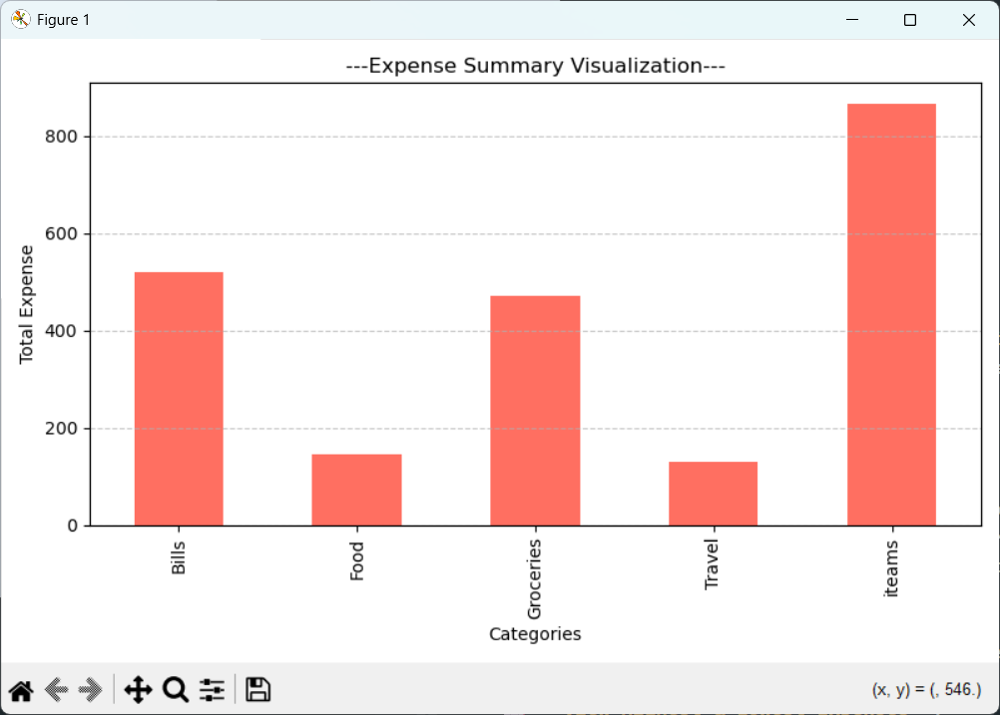
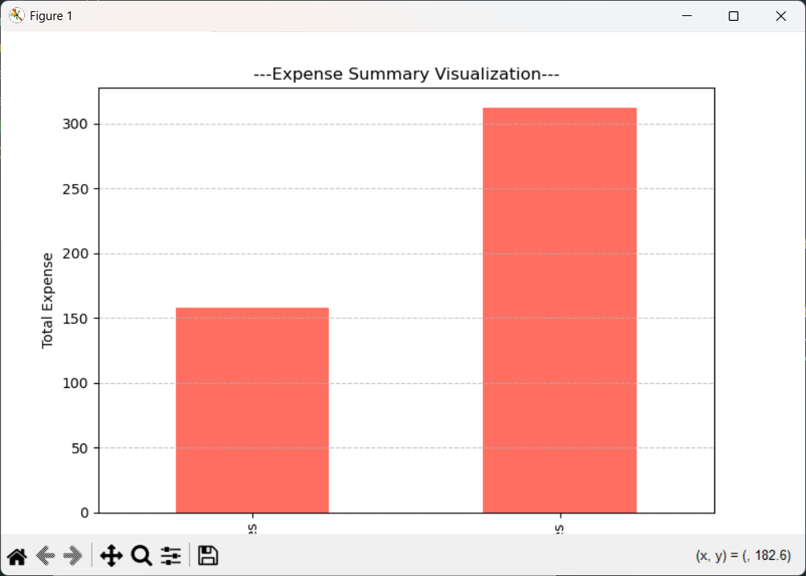
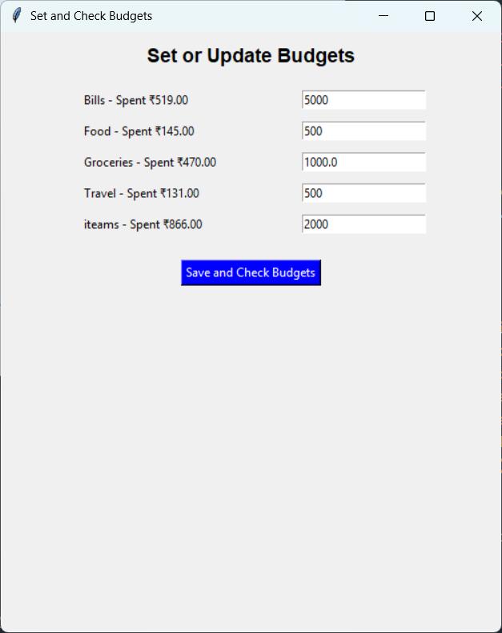

This is a personal **Expense Tracker Application**.It allows users to easily add, manage, and visualize their daily expenses with both default and custom categories.
# 🧾 Expense Tracker GUI (Python + Tkinter + Matplotlib + Pandas + JSON)
## 📌 Features

- ✅ **Add Expenses** with amount, description, date, and category.
- 🗂️ **Default and Custom Categories** supported.<br>
  
<br>

- **Total expense summary<br> 
<br>
- 📊 **Visualize Expenses**: View bar charts of your spending by category.<br>
<br>
- ⬆️ **Export to Excel (.xlsx)**.<br>
<br>
- 📆 **View by Period**: Filter expenses by today, last 7 days, or this month.<br>
<br>
- 📉 **View Highest & Lowest Expenses**.<br>
<br>
- 🔍 **Search Functionality**: Search expenses by keyword or date.<br>
<br>
- 💰 **Set & Check Budgets**: Define monthly budgets per category and get alerts when overspending.<br>
<br>
<br>
- 🧩 **Category Management**: Add, edit, or delete custom categories.<br>


## 🚀 How to Run

1. **Install Python** (version 3.7 or higher).
2. Install dependencies:

    ```bash
    pip install pandas matplotlib openpyxl
    ```

3. **Run the app**:

    ```bash
    python expense_tracker_gui.py
    ```

## 📁 File Structure

- `expenses.json`: Stores all expense entries.
- `custom_categories.json`: Stores user-defined categories.
- `budgets.json`: Stores budget limits for categories.

## 🛠 Technologies Used

- `Tkinter`: GUI framework
- `Pandas`: Data analysis and grouping
- `Matplotlib`: Charts and visualizations
- `JSON`: Local data storage
- `Openpyxl`: Excel file export


- UI is styled with light pastel colors (`#e6f2ff`) for a clean user experience.

---

💡 Happy Budgeting!
